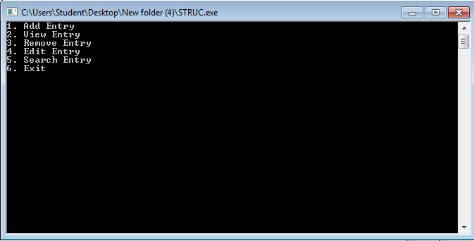
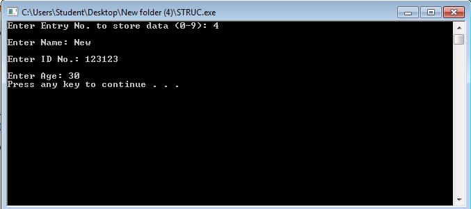
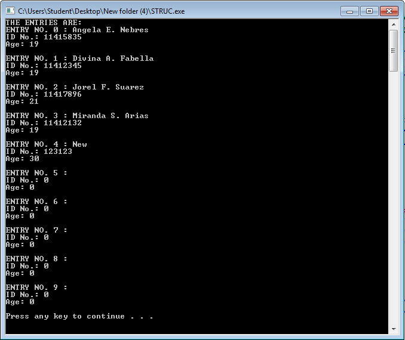
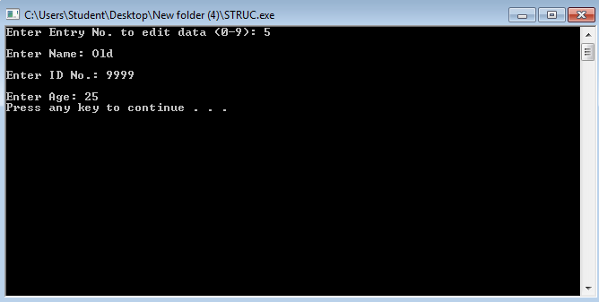
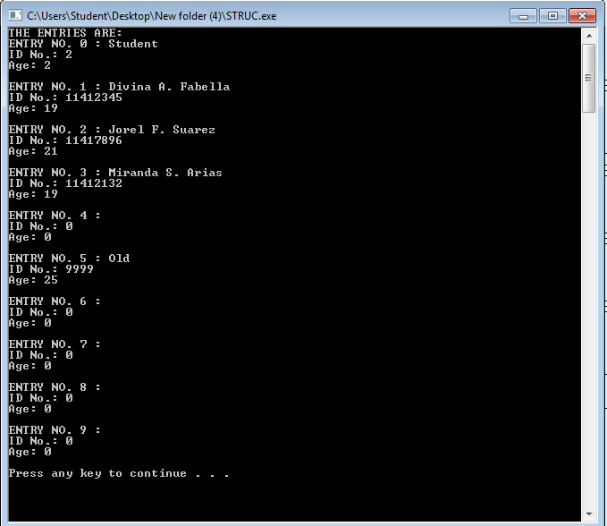

# lbyec72-ej1-p5-strings-angelanebres
lbyec72-ej1-p5-strings-angelanebres created by GitHub Classroom

UPDATE- AUGUST 2, 2016

JULY 12 - STRINGS

MAIN MENU

Display the strings in database

Search in the database

Add string to database

Exit program

